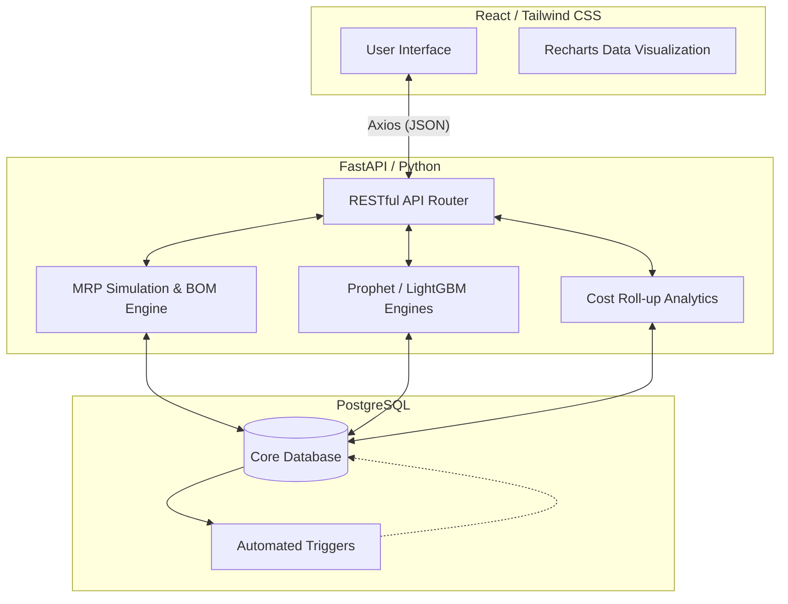
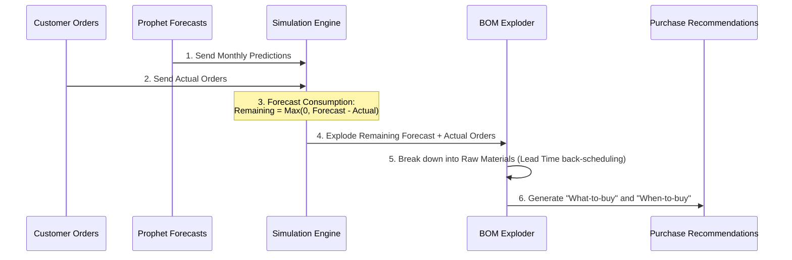

<div align="center">
  
  <h1>AIERP - Intelligent ERP & MRP System</h1>
  <p><em>Advanced Material Requirements Planning powered by Machine Learning and Predictive Analytics</em></p>
</div>

---

## 📖 Overview

> 🚧 **Work in Progress:** AIERP is currently under active development. While the core MRP simulation, AI forecasting, and basic inventory/procurement modules are fully functional and completed, the project as a whole is an ongoing effort with more features actively being built.

**AIERP** is a next-generation Enterprise Resource Planning (ERP) and Material Requirements Planning (MRP) platform. Built to optimize supply chains and eliminate stockouts, it combines traditional hierarchical **Bill of Materials (BOM) explosion** with **Machine Learning (Prophet & LightGBM)** to accurately forecast demand and dynamically calculate safety stocks.

This project was built from the ground up, utilizing a modern decoupled architecture with a **FastAPI (Python)** backend, a **React (Vite)** frontend, and a highly normalized **PostgreSQL** database featuring automated triggers.

## 🚀 Key Features

### 🧠 1. AI-Powered Forecasting & Safety Stock
* **Demand Forecasting:** Utilizes Meta's **Prophet** algorithm to predict future monthly demand. By analyzing historical sales data (`sales_out_history`), the model automatically detects yearly seasonality, monthly trends, and holiday impacts. It projects a realistic baseline demand, preventing overstocking during off-seasons and preventing stockouts during peak seasons.
* **Smart Safety Stock Calculation (Hybrid AI/Statistical):** Traditional safety stocks rely on static buffers. AIERP generates two distinct, risk-adjusted safety stock proposals:
  * **1. Statistical (King's Formula):** Employs the industry-standard formula ($Z \times \sqrt{(LT \times \sigma_d^2) + (d_{avg}^2 \times \sigma_{LT}^2)}$) assuming normal distribution to cover demand ($\sigma_d$) and lead time ($\sigma_{LT}$) variations for a targeted 95% service level ($Z$).
  * **2. Machine Learning (LightGBM Quantile Regression):** Rather than treating safety stock as a static buffer, the LightGBM model utilizes **Quantile Regression ($\alpha = 0.85$)** to predict the 85th percentile of future consumption. It acts as a powerful ensemble and risk-assessment model by ingesting:
    * **Baseline AI Forecast:** Prophet's monthly demand prediction.
    * **Statistical Baseline:** The output of King's Formula itself is used as a feature (`result_king`).
    * **Supplier Risk Mapping:** Calculates maximum/average supplier delays and urgent order ratios from historical purchase orders. Crucially, it filters out early deliveries (`GREATEST(0, delay_day)`) so that early arrivals don't artificially mask a supplier's lateness risk.
    * **Consumption Momentum:** 6-month and 12-month rolling consumption averages.
    By synthesizing these features, LightGBM learns the non-linear relationship between supplier unreliability and consumption volatility, outputting an adaptive safety stock target with an 85% confidence level.

### ⚙️ 2. Dynamic MRP Simulation & Procurement Map
The core simulation engine generates a time-phased purchasing and production map by preventing double-counting via **Forecast Consumption**.
* **Forecast Netting:** The system deducts actual, locked-in customer orders from the AI-predicted forecasts for the given month. Only the remaining (unconsumed) forecast is treated as theoretical future demand.
* **Safety Stock & Pending Orders:** Incorporates approved safety stock targets as demand, and deducts pending purchase orders (`Bekleniyor` status) as incoming supply to avoid recommending unnecessary purchases.
* **Simulation Memory:** The engine cleanly separates the current physical warehouse stock (`active_inventory`) from future projections. It clones current stock into a virtual memory (`planned_inventory`), continuously deducting future exploded demands. If this virtual stock falls below zero, it dynamically triggers a raw material purchase recommendation.
* **BOM Explosion & Backward Scheduling:** All net demands (customer orders + unconsumed forecast + safety stock deficits) are recursively exploded down the BOM tree. Using supplier lead times, the system schedules backward to recommend exact "Order Dates" and "Quantities" for raw materials, ensuring they arrive just in time for production.

### 🏭 3. Deep BOM (Bill of Materials) Management
* Multi-level BOM support (End Product $\rightarrow$ Sub-Assembly $\rightarrow$ Raw Material).
* Automatic **Cost Roll-Up**: Modifying a raw material's cost automatically recalculates the total unit cost of all parent products that rely on it.

### 📦 4. End-to-End Inventory & Procurement
* **Stock Movements:** Real-time, multi-location inventory tracking (Main Depot, Production Line). Fully auditable stock movements handled securely by PostgreSQL database triggers.
* **Supplier & Purchase Management:** Tracks supplier performance, lot sizes (MOQ), and calculates actual vs. given lead times to adjust safety stocks.

---

## 🏗️ System Architecture & Data Flow



### 🔄 The MRP "Forecast Consumption" Workflow


---

## 🛠️ Technology Stack

**Frontend:**
* **React 18** (Vite for rapid bundling)
* **Tailwind CSS** (Utility-first styling, Glassmorphism aesthetics)
* **Recharts** (Interactive data visualization)
* **Lucide React** (Modern iconography)

**Backend:**
* **Python 3.10+ & FastAPI** (High performance, async framework)
* **Pandas & NumPy** (Data manipulation and matrix operations)
* **Prophet & LightGBM** (Time-series forecasting and gradient boosting)
* **Pydantic** (Data validation and serialization)
* **Uvicorn** (ASGI web server)

**Database:**
* **PostgreSQL** (Relational data, complex joins, and JSONB)
* **Native Database Triggers** (For real-time stock sync and sales logging without application-layer overhead)

---

## 📂 Project Structure

```text
📦 AIERP
 ┣ 📂 backend
 ┃ ┣ 📂 database          # PostgreSQL connection pool and setup scripts
 ┃ ┣ 📂 modules           # Decoupled domain modules
 ┃ ┃ ┣ 📂 core            # Products, BOM, Cost Analytics
 ┃ ┃ ┣ 📂 forecasting     # Prophet (Demand) & LightGBM (Safety Stock)
 ┃ ┃ ┣ 📂 inventory       # Active Stock, Movements, Sales History
 ┃ ┃ ┣ 📂 procurement     # Suppliers, Purchase Orders
 ┃ ┃ ┣ 📂 sales           # Customer Orders
 ┃ ┃ ┗ 📂 simulation      # MRP Engine, Order Map, Forecast Consumption
 ┃ ┣ 📜 main.py           # FastAPI entry point
 ┃ ┗ 📜 requirements.txt  # Python dependencies
 ┣ 📂 frontend
 ┃ ┣ 📂 src
 ┃ ┃ ┣ 📂 modules         # Page components mirroring backend structure
 ┃ ┃ ┣ 📂 shared          # Layouts, UI Components, Icons
 ┃ ┃ ┗ 📜 api.js          # Axios interceptors and global config
 ┃ ┣ 📜 package.json      # Node.js dependencies
 ┃ ┗ 📜 tailwind.config.js
 ┗ 📜 README.md
```

---

## 💡 Key Learnings & Engineering Highlights

- **Overcoming Double-Counting in MRP:** Built a custom forecast consumption algorithm that aligns theoretical AI predictions with actual locked-in sales, preventing the system from over-purchasing raw materials.
- **Database Trigger Reliability:** Moved critical path logic (like deducting inventory on a sales shipment or updating historical sales logs) into PostgreSQL triggers. This guarantees data integrity even if the backend API crashes mid-request.
- **FastAPI Modularization:** Scaled the backend using FastAPI's `APIRouter`, completely decoupling inventory logic from ML forecasting and procurement.

---
