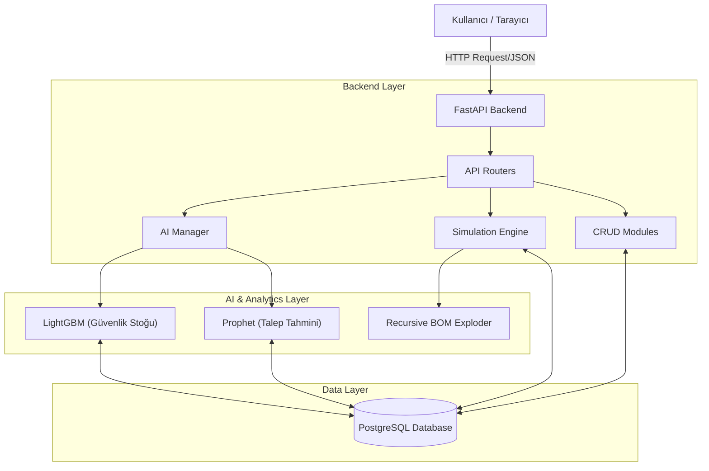

# 🏛️ Sistem Mimarisi ve Teknik Genel Bakış (System Architecture)

## 1. Giriş
**AI-ML SSL MRP**, yapay zeka destekli bir Malzeme İhtiyaç Planlama (MRP) sistemidir. Geleneksel MRP sistemlerinden farklı olarak, stok seviyelerini belirlerken sadece statik formülleri değil, **Makine Öğrenmesi (ML)** ve **Zaman Serisi Analizi (Time Series)** yöntemlerini kullanır.

## 2. Teknoloji Yığını (Tech Stack)

### 🖥️ Frontend (Kullanıcı Arayüzü)
*   **Framework:** React (+ Vite)
*   **Dil:** JavaScript (ES6+)
*   **Stil:** TailwindCSS
*   **İkon Seti:** Lucide React
*   **Http İstemcisi:** Axios

### ⚙️ Backend (Sunucu ve İş Mantığı)
*   **Framework:** FastAPI (Python)
*   **Dil:** Python 3.9+
*   **Veritabanı Sürücüsü:** Psycopg2
*   **Veri İşleme:** Pandas, NumPy

### 🧠 Yapay Zeka ve Analitik (AI Core)
*   **Tahminleme (Forecasting):** Facebook Prophet
*   **Optimizasyon (Safety Stock):** LightGBM (Gradient Boosting)
*   **Simülasyon:** Özel Geliştirilmiş Recursive BOM Explosion Algoritması

### 🗄️ Veritabanı
*   **Motor:** PostgreSQL
*   **Özellikler:** Stored Procedures, Triggers, Generated Columns (King's Formula için)

---

## 3. Sistem Bileşen Diyagramı



## 4. Temel Veri Akışı (Data Flow)

Sistemin "Kalbi" olan **Sipariş -> Simülasyon -> Satın Alma** döngüsü şu şekilde işler:

1.  **Sipariş Girişi:**
    *   Kullanıcı Frontend üzerinden bir `Müşteri Siparişi` girer.
    *   API bunu `customer_orders` tablosuna kaydeder.

2.  **Simülasyon Tetiklenmesi:**
    *   Sipariş girildiği an, **Simulation Engine** devreye girer.
    *   Ürünün reçetesi (BOM) en alt seviyeye kadar patlatılır.
    *   Mevcut stok ve yoldaki siparişler zaman çizelgesine yerleştirilir.

3.  **Eksik Tespiti (Shortage):**
    *   Simülasyon sonucunda eğer bir hammadde eksiği çıkarsa, `sim_simulation_suggestions` tablosuna bir kayıt atılır.
    *   Bu kayıt Frontend'de "Sipariş Haritası" ekranında **Uyarı** olarak görünür.

4.  **AI Devreye Girmesi (Gece Operasyonu veya Manuel):**
    *   **Prophet:** Geçmiş satışlardan gelecek ayın talebini tahmin eder.
    *   **LightGBM:** Tedarikçi risklerini analiz edip "Ne kadar güvenlik stoğu tutmalıyız?" sorusunu cevaplar.

## 5. Klasör Yapısı (Directory Structure)

```
.
├── backend/               # Python/FastAPI Sunucu Kodları
│   ├── AI_ML/             # Prophet ve LightGBM Modelleri
│   ├── crud/              # Veritabanı Okuma/Yazma İşlemleri
│   ├── database/          # Veritabanı Bağlantı ve Kurulum Dosyaları
│   ├── simulation/        # Simülasyon ve BOM Patlatma Mantığı
│   └── main.py            # API Giriş Noktası
│
├── frontend/              # React Arayüz Kodları
│   ├── src/
│   │   ├── components/    # Ortak Bileşenler (Tablo, Buton vb.)
│   │   ├── pages/         # Uygulama Sayfaları
│   │   └── api.js         # Backend Bağlantı Ayarları
│
└── system_documentation/  # Proje Dokümantasyonu
    ├── user_manuals/      # Kullanıcı Kılavuzları
    └── technical_reference/ # Teknik Algoritma Açıklamaları
```
