# 🗄️ Veritabanı Şeması ve İlişki Haritası (Database Schema)

Bu belge, AI tabanlı MRP sisteminin veritabanı yapısını, tablolar arası ilişkileri ve otomasyonu sağlayan trigger mekanizmalarını detaylandırır.

## 📊 Varlık İlişki Diyagramı (ERD)

Aşağıdaki diyagram, sistemdeki **TÜM** tabloların sütun ve veri tiplerini kapsamlı bir şekilde gösterir.

```mermaid
erDiagram
    %% İlişkiler
    ITEM ||--o| ACTIVE_INVENTORY : "tracks"
    ITEM ||--o{ STOCK_MOVEMENT : "logs"
    ITEM ||--o{ SALES_OUT_HISTORY : "archives"
    ITEM ||--o{ START_INVENTORIES : "snapshots"
    ITEM ||--o{ CUSTOMER_ORDERS : "ordered"
    ITEM ||--o{ BOM : "parent"
    ITEM ||--o{ BOM : "child"
    ITEM ||--o{ SUPPLIER_ITEM : "supplied_by"
    
    SUPPLIER_ITEM ||--o{ PURCHASE : "fulfilled_by"
    SUPPLIER_ITEM ||--|| SS_KINGS_FORMULA : "risk_params"

    CUSTOMER_ORDERS ||--o{ SIM_ORDER_EFFECTS : "impacts"
    
    ITEM ||--o| SIP_HARITA_ACTIVE_INVENTORY : "simulates"
    ITEM ||--o{ PROPHET_TABLE_HISTORY : "forecasts"
    ITEM ||--o{ PROPHET_TABLE_TEMPORARY : "temp_forecasts"
    ITEM ||--o{ SS_AI_HISTORY : "ai_safety_stock"
    ITEM ||--o{ SS_AI_TEMPORARY : "temp_ai_ss"
    ITEM ||--o{ FINAL_SAFETY_STOCK : "final_report"
    ITEM ||--o{ CALCULATED_FULL_SS_AI_TEMP : "bom_explosion"

    %%-------------------------------------------------------------------------
    %% 1. ANA VERİ TABLOLARI (MASTER DATA)
    %%-------------------------------------------------------------------------
    
    ITEM {
        varchar item_id PK
        enum item_type "mamül, yarı_mamül, hammadde"
        enum item_quantity_type "adet, gram, litre"
        enum activity_status "Aktif, Pasif"
        decimal demand_avg
        decimal demand_deviation
    }

    SUPPLIER_ITEM {
        varchar item_id PK, FK
        varchar supplier_id PK
        decimal calculated_leadtime_avg
        decimal calculated_leadtime_deviation
        decimal given_leadtime
        decimal given_leadtime_deviation
        decimal lot_size
        decimal min_size
        decimal max_size
        boolean calculated
        enum activity_status
    }

    BOM {
        varchar parent_id PK, FK
        varchar child_id PK, FK
        decimal amount
        enum activity_status
    }

    ACTIVE_INVENTORY {
        varchar item_id PK, FK
        decimal current_stock
    }

    %%-------------------------------------------------------------------------
    %% 2. HAREKET TABLOLARI (TRANSACTION DATA)
    %%-------------------------------------------------------------------------

    PURCHASE {
        serial id PK
        varchar item_id FK
        varchar supplier_id FK
        decimal amount
        date purchase_date
        date expected_coming_date
        date actual_coming_date
        numeric delay_day "Generated"
        varchar status "Generated"
        enum purpose "emniyet_stoku, acil, normal"
    }

    STOCK_MOVEMENT {
        serial id PK
        varchar item_id FK
        decimal amount
        enum purpose "giriş, çıkış, üretim, satış"
        date date
    }

    START_INVENTORIES {
        varchar item_id PK, FK
        date date PK
        decimal amount
    }

    SALES_OUT_HISTORY {
        serial id PK
        varchar item_id FK
        decimal amount
        date date
    }

    CUSTOMER_ORDERS {
        serial id PK
        varchar customer_name
        varchar item_id FK
        decimal amount
        date order_date
        date expected_delivery_date
        date delivery_date
        int production_time_days
        enum status "Bekleniyor, Üretimde, Sevk"
    }

    %%-------------------------------------------------------------------------
    %% 3. ANALİTİK VE YAPAY ZEKA TABLOLARI
    %%-------------------------------------------------------------------------

    SS_KINGS_FORMULA {
        varchar item_id PK, FK
        varchar supplier_id PK, FK
        decimal demand_avg
        decimal leadtime_avg
        decimal demand_deviation
        decimal leadtime_deviation
        numeric z_score
        numeric result_king "Generated"
        enum activity_status
    }

    PROPHET_TABLE_HISTORY {
        varchar item_id PK, FK
        date date PK
        decimal amount
    }

    PROPHET_TABLE_TEMPORARY {
        varchar item_id PK, FK
        date date PK
        decimal amount
    }

    SS_AI_HISTORY {
        varchar item_id PK, FK
        date date PK
        decimal amount
    }

    SS_AI_TEMPORARY {
        varchar item_id PK, FK
        date date PK
        decimal amount
    }

    FINAL_SAFETY_STOCK {
        varchar item_id PK, FK
        date date PK
        decimal safety_stock
        enum item_quantity_type
    }

    CALCULATED_FULL_SS_AI_TEMP {
        varchar item_id PK, FK
        date date PK
        varchar status PK "Level Bilgisi"
        decimal amount
        enum item_type
        enum item_quantity_type
    }

    %%-------------------------------------------------------------------------
    %% 4. SİMÜLASYON TABLOLARI
    %%-------------------------------------------------------------------------

    SIP_HARITA_ACTIVE_INVENTORY {
        varchar item_id PK, FK
        decimal current_stock
    }

    SIM_ORDER_EFFECTS {
        serial id PK
        int order_id FK
        varchar item_id FK
        decimal amount_changed
        date due_date
        timestamp created_at
    }

    ORDER_MATERIAL_CONSUMPTION {
        serial id PK
        int order_id FK
        varchar item_id FK
        decimal amount
    }
```

---

## 📑 Tablo ve Sütun Açıklamaları

### 1. Ana Veri Tabloları (Master Data)

- **`ITEM`**: Tüm stok kartlarının tanımlandığı ana tablodur. `demand_avg` ve `demand_deviation` triggerlar ile sürekli güncel tutulur.
- **`SUPPLIER_ITEM`**: Malzeme-Tedarikçi ilişkisini tanımlar. `calculated_leadtime` alanları sistem tarafından performans geçmişine göre doldurulur.
- **`BOM`**: Ürün reçetelerini (ağaç yapısı) tutar.
- **`ACTIVE_INVENTORY`**: Depodaki anlık, fiziksel stok miktarını tutar.

### 2. Hareket Tabloları (Transaction Data)

- **`PURCHASE`**: Tedarikçilere verilen siparişlerdir. `delay_day` sütunu, `actual_coming_date` girildiği an otomatik hesaplanır.
- **`STOCK_MOVEMENT`**: Depodaki tüm giriş/çıkış hareketleridir.
- **`CUSTOMER_ORDERS`**: Müşterilerden alınan satış siparişleridir. "Sevk Edildi" veya "Hazır" olduğunda ilgili tüketim kayıtları otomatik temizlenir.
- **`START_INVENTORIES`**: Her ay başında sistemin otomatik aldığı stok fotoğraflarıdır (Snapshot).
- **`SALES_OUT_HISTORY`**: Satış amacıyla çıkış yapılan stok hareketlerinin kopyasıdır, talep tahminlemede kullanılır.
- **`ORDER_MATERIAL_CONSUMPTION`**: Bir sipariş için üretime verilen malzemeleri takip eder. Simülasyonun mükerrer hesap yapmasını engeller.

### 3. Analitik ve Yapay Zeka Tabloları

- **`SS_KINGS_FORMULA`**: Klasik istatistiksel yöntemle (King's Formula) hesaplanan güvenlik stoğu önerileridir. `result_king` sütunu veritabanı tarafından otomatik hesaplanır.
- **`PROPHET...`**: Facebook Prophet algoritmasının zaman serisi tahminleridir (History: Kesinleşmiş, Temporary: Hesaplanan/Taslak).
- **`SS_AI...`**: LightGBM algoritmasının ürettiği yapay zeka tabanlı güvenlik stoğu tahminleridir.
- **`CALCULATED_FULL_SS_AI_TEMP`**: BOM patlatma işlemi sırasında, her seviyedeki (`Level 0` - `Level N`) ihtiyacı hesaplamak için kullanılan geçici çalışma tablosudur.
- **`FINAL_SAFETY_STOCK`**: Tüm algoritmalar çalıştıktan sonra yöneticinin önüne gelen nihai güvenlik stoğu rapor tablosudur.

### 4. Simülasyon Tabloları

- **`SIP_HARITA_ACTIVE_INVENTORY`**: Müşteri siparişlerinin "Ne olurdu?" senaryolarını denemek için kullanılan sanal stok tablosudur. Gerçek stoku bozmadan simülasyon yapmayı sağlar.
- **`SIM_ORDER_EFFECTS`**: Her bir müşteri siparişinin simülasyon stoğu üzerindeki etkisini (rezerve ettiği miktar vb.) takip eder.

---

## ⚡ Otomasyon (Triggers)

Bu tablolar arasındaki veri akışı **PostgreSQL Triggerları** ile sağlanır:
1.  **Stok Güncelleme:** `STOCK_MOVEMENT` -> `ACTIVE_INVENTORY`
2.  **Talep İstatistiği:** `PURCHASE` / `SALES` -> `ITEM` (Ortalama Talep)
3.  **Performans Analizi:** `PURCHASE` -> `SUPPLIER_ITEM` (Lead Time)
4.  **Risk Analizi:** `SUPPLIER_ITEM` -> `SS_KINGS_FORMULA`
5.  **Aylık Arşiv:** `STOCK_MOVEMENT` -> `START_INVENTORIES`
6.  **Simülasyon Senk:** `ACTIVE_INVENTORY` -> `SIP_HARITA_ACTIVE_INVENTORY` (Gerçek stok değişince simülasyon başlangıcı da güncellenir)
