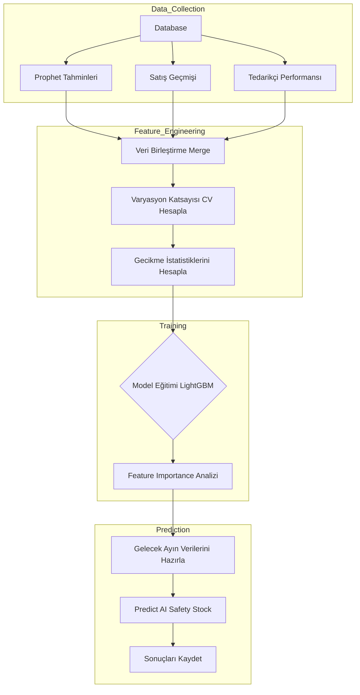

# 🚀 LightGBM Algoritması: Teknik Çalışma Prensibi

## 1. Genel Bakış
**LightGBM (Light Gradient Boosting Machine)**, Microsoft tarafından geliştirilen, karar ağacı (decision tree) tabanlı, son derece hızlı ve yüksek performanslı bir makine öğrenmesi algoritmasıdır.

Bu sistemde LightGBM, **Güvenlik Stoğu Optimizasyonu** için kullanılır. Klasik yöntemlerin (King's Formula) aksine, sadece standart sapmaya bakmaz; tedarikçi riski, mevsimsellik ve talep trendi gibi birçok karmaşık faktörü öğrenerek karar verir.

---

## 2. Özellik Mühendisliği (Feature Engineering)
Modelin başarısı, ona verilen girdilerin (Features) kalitesine bağlıdır. Sistemimiz şu verileri kullanarak modeli eğitir:

### A. Talep Özellikleri (Demand Features)
*   **`actual_consumption`:** Geçmiş aylardaki gerçek tüketim.
*   **`prophet_forecast`:** Prophet'ten gelen gelecek tahmini (Bu, iki modelin birbirini beslediği hibrit bir yapıdır).
*   **`cv` (Coefficient of Variation):** Talebin ne kadar dalgalı olduğu. (Std Dev / Mean).

### B. Tedarik Özellikleri (Supply Features)
*   **`leadtime_avg`:** Tedarikçinin ortalama teslim süresi.
*   **`leadtime_deviation`:** Tedarikçinin gecikme sapması. (Sapma ne kadar yüksekse risk o kadar büyüktür).
*   **`supplier_score`:** Tedarikçinin güvenilirlik puanı.

### C. Zaman Özellikleri (Temporal Features)
*   **`month`:** Hangi aydayız? (Mevsimselliği yakalamak için).
*   **`quarter`:** Yılın hangi çeyreği?

---

## 3. Model Eğitimi ve Hedef Değişken (Target)
Model, **"İdeal Stok Seviyesi Ne Olmalı?"** sorusunu öğrenmeye çalışır.

*   **Eğitim Verisi:** Geçmişte yaşanan stok yetersizlikleri (Stockout) ve aşırı stok durumları analiz edilir.
*   **Hedef (Label):** Geçmiş veriden hesaplanan "Optimum Service Level" karşılığıdır.

Model parametreleri:
*   **`objective`:** 'regression' (Sayısal bir stok miktarı tahmin ediyoruz).
*   **`metric`:** 'rmse' (Hata kareler ortalamasının karekökü - Hatayı minimize etmeye çalışır).
*   **`boosting`:** 'gbdt' (Gradient Boosting Decision Tree).

---

## 4. Çalışma Akışı (Flowchart)

## 5. Neden King's Formula Yerine LightGBM?
*   **Doğrusallık:** King formülü doğrusal varsayımlarla çalışır. LightGBM ise doğrusal olmayan ilişkileri (örneğin: Tedarikçi süresi uzadıkça riskin üstel artması) yakalayabilir.
*   **Dış Veri:** Prophet'ten gelen gelecek tahminini girdi olarak kullanabilmesi, onu "İleriye dönük" (Proactive) hale getirir. Klasik formüller sadece "Geriye dönük" (Reactive) çalışır.
