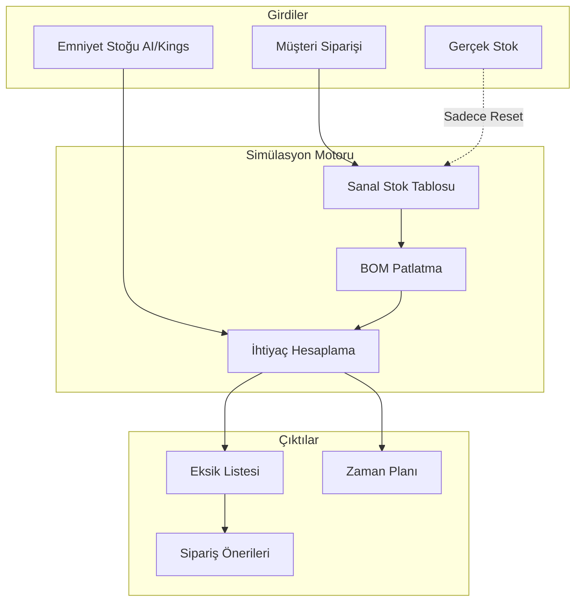
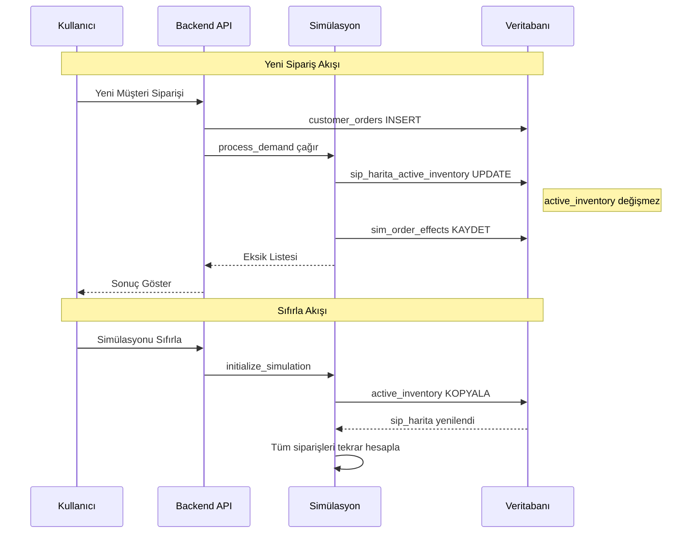
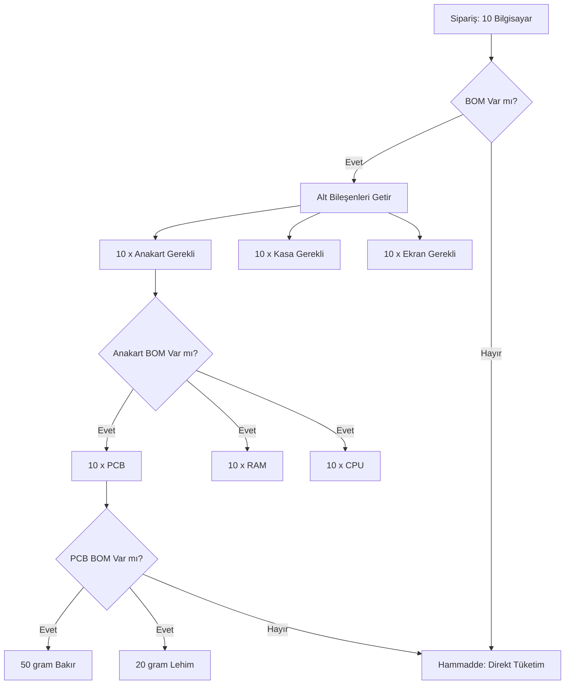
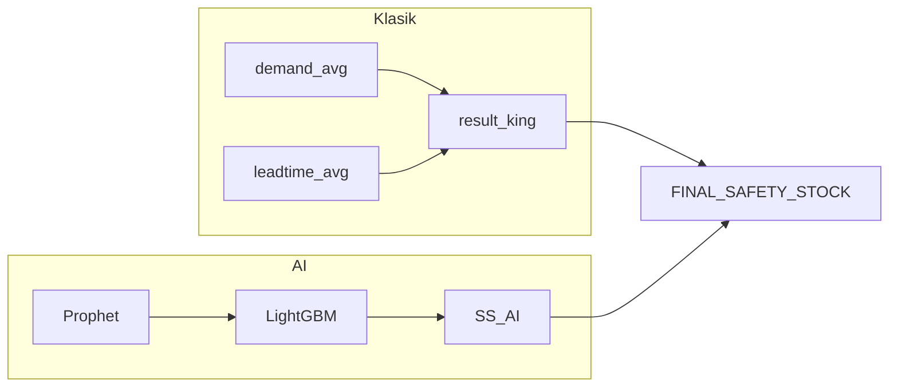
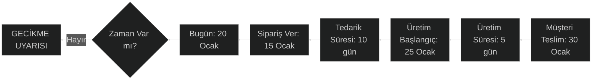
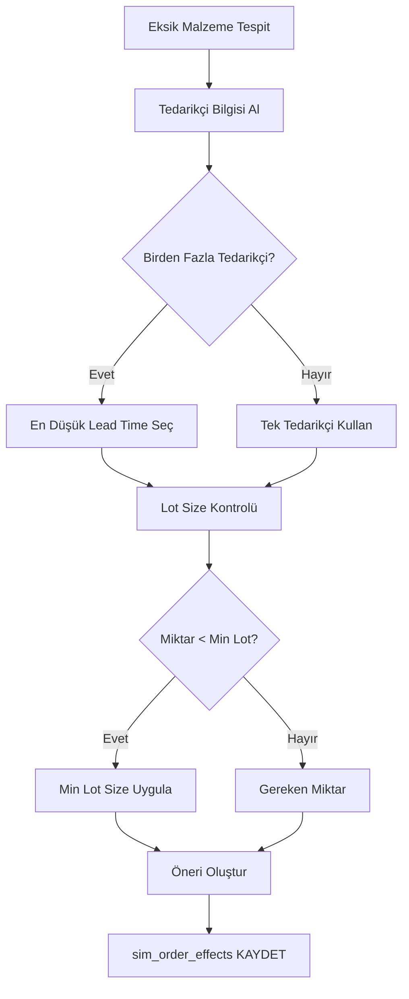
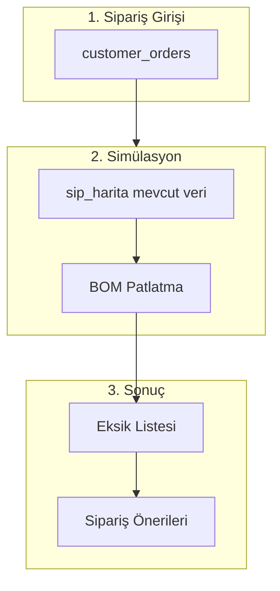
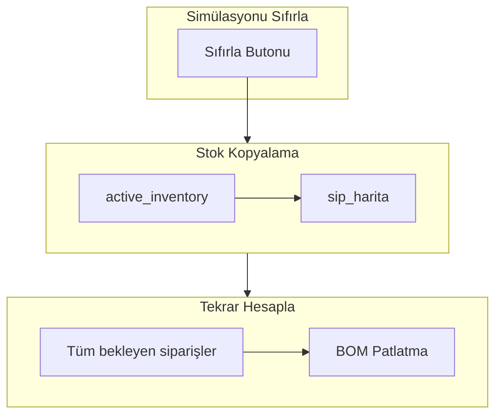

# 🗺️ Sipariş Haritalama ve MRP Simülasyon Sistemi

## 1. Genel Bakış

Sipariş Haritalama (Order Mapping), sistemin **"Geleceği Simüle Etme"** yeteneğidir. Bu modül dört ana süreci entegre eder:

1. **Müşteri Siparişi Simülasyonu** - Yeni sipariş geldiğinde stok etkisini analiz eder
2. **BOM Patlatma (Explosion)** - Ürün reçetesini en alt seviyeye kadar parçalar
3. **Emniyet Stoğu Entegrasyonu** - AI destekli güvenlik stoğu hesaplamalarını kullanır
4. **Satın Alma Tetikleme** - Eksik malzemeler için sipariş önerileri oluşturur

---

## 2. Sistem Mimarisi



---

## 3. Müşteri Siparişi Simülasyonu

### 3.1 Tetikleme Mekanizmaları

Sanal stok (\`sip_harita_active_inventory\`), üç farklı kaynaktan beslenir:

| Tetikleyici | Tür | Mekanizma | Etkisi |
|-------------|-----|-----------|--------|
| **1. Yeni Sipariş / Güncelleme** | Uygulama (Backend) | \`process_demand()\` | Sadece sanal stoktan düşer (Rezervasyon). Gerçek stoğu ETKİLEMEZ. |
| **2. Stok Hareketi (Giriş/Çıkış)** | Veritabanı (Trigger) | \`trigger_update_active_inventory\` | Hem gerçek hem sanal stoğu EŞ ZAMANLI günceller. |
| **3. Simülasyonu Sıfırla** | Kullanıcı Aksiyonu | \`initialize_simulation()\` | Gerçek stoğu sanal stoğa birebir kopyalar (Full Sync). |

### 3.2 Sanal Stok Mekanizması

**Kritik Ayrım:**
*   **Gerçekleşen Olaylar (Geçmiş):** Depoya mal girmesi veya üretimden çıkmasıdır. Bu olaylar `stock_movement` tablosuna yazılır ve bir **Database Trigger** sayesinde anında hem gerçek hem sanal stoğa işlenir.
*   **Planlanan Olaylar (Gelecek):** Müşteri siparişidir. Bu olaylar henüz gerçekleşmemiştir, sadece planlamadır. Bu yüzden sadece sanal stok üzerinde işlem yapar.

| Tablo | Açıklama |
|-------|----------|
| `active_inventory` | Gerçek fiziksel stok (Sadece gerçekleşen olaylarla değişir) |
| `sip_harita_active_inventory` | Sanal stok (Gerçek olaylar + Gelecek sipariş rezervasyonları) |
| `sim_order_effects` | Hangi siparişin ne kadar rezervasyon yaptığının kaydı |


```

---

## 4. BOM Patlatma (Recursive Explosion)

BOM patlatma, bir mamül ürünü en alt seviye hammaddeye kadar parçalama işlemidir.

### 4.1 Seviye Yapısı

```
Level 0: Mamül (Örn: Bilgisayar)
    └── Level 1: Yarı Mamül (Örn: Anakart)
            └── Level 2: Yarı Mamül (Örn: PCB)
                    └── Level 3: Hammadde (Örn: Bakır)
```

### 4.2 Patlatma Algoritması



### 4.3 Matematiksel Model (Recursive Explosion)

Her bir bileşen için toplam ihtiyaç şu genel formül ile hesaplanır:

```math
TotalNeed(Item) = \sum_{p \in Parents} (Need(p) \times Quantity(p \to Item))
```

**Örnek Hesaplama:**
10 Adet Bilgisayar Siparişi ($Order_{qty} = 10$)
*   $Need(Anakart) = 10 \times 1 = 10$
*   $Need(Bakır) = Need(Anakart) \times 5g = 10 \times 5 = 50g$

---

## 5. Emniyet Stoğu Entegrasyonu

Simülasyon, hem klasik hem de AI tabanlı emniyet stoğu hesaplamalarını dikkate alır.

### 5.1 İki Kaynak



### 5.2 Simülasyon Karar Mantığı

Stok kontrolü anlık olarak aşağıdaki eşitsizlik ile yapılır:

```math
Available(t) = VirtualStock(t) - SafetyStock(t)
```

Karar Matrisi:
| Durum | Formül | Sonuç |
|-------|--------|-------|
| **Yeterli** | $Available(t) \geq 0$ | ✅ Stoktan Rezerve Et |
| **Eksik** | $Available(t) < 0$ | ⚠️ Eksik Miktar = $|Available(t)|$ |

---

## 6. Satın Alma Tetikleme ve Zamanlama

### 6.1 Geriye Doğru Zamanlama (Backward Scheduling)

Sipariş verilmesi gereken en geç tarih ($T_{order}$) şu formülle bulunur:

```math
T_{order} = T_{due} - (LeadTime_{supplier} + ProductionTime)
```

*   $T_{due}$: Müşteriye teslim tarihi
*   $LeadTime$: Tedarikçinin getirme süresi
*   $ProductionTime$: Üretim hattındaki işlem süresi



### 6.2 Sipariş Öneri Algoritması



---

## 7. Veri Akışı Özeti

### 7.1 Yeni Sipariş Akışı (Gerçek stoktan çekmez)



### 7.2 Sıfırlama Akışı (Gerçek stoktan kopyalar)



---

## 8. Kullanılan Veritabanı Tabloları

| Tablo | Rol |
|-------|-----|
| `customer_orders` | Müşteri siparişleri (tetikleyici) |
| `bom` | Ürün reçeteleri (parent-child ilişkisi) |
| `active_inventory` | Gerçek fiziksel stok |
| `sip_harita_active_inventory` | Sanal simülasyon stoğu |
| `sim_order_effects` | Sipariş bazlı stok etkileri |
| `supplier_item` | Tedarikçi bilgileri ve lead time |
| `final_safety_stock` | Onaylı emniyet stoğu |
| `ss_kings_formula` | Klasik hesaplama sonuçları |
| `ss_ai_temporary` | AI hesaplama sonuçları |

---

## 9. Örnek Senaryo

**Durum:** 100 adet "Tablet" siparişi geldi. Teslim tarihi 15 gün sonra.

**Adım 1:** BOM Patlatma
- Tablet → 1 Ekran, 1 Pil, 1 Anakart
- Anakart → 2 RAM, 1 CPU, 50g Lehim

**Adım 2:** Stok Kontrolü
| Malzeme | Stok | İhtiyaç | Emniyet | Kullanılabilir | Sonuç |
|---------|------|---------|---------|----------------|-------|
| Ekran | 150 | 100 | 20 | 130 | ✅ Yeterli |
| Pil | 80 | 100 | 15 | 65 | ⚠️ 35 Eksik |
| RAM | 100 | 200 | 30 | 70 | ⚠️ 130 Eksik |

**Adım 3:** Sipariş Önerileri
| Malzeme | Eksik | Lot Size | Sipariş | Lead Time | Son Tarih |
|---------|-------|----------|---------|-----------|-----------|
| Pil | 35 | 50 | 50 adet | 7 gün | 5 gün sonra |
| RAM | 130 | 100 | 200 adet | 10 gün | 2 gün sonra |

**Sonuç:** RAM siparişi için zaman kritik! 🚨
