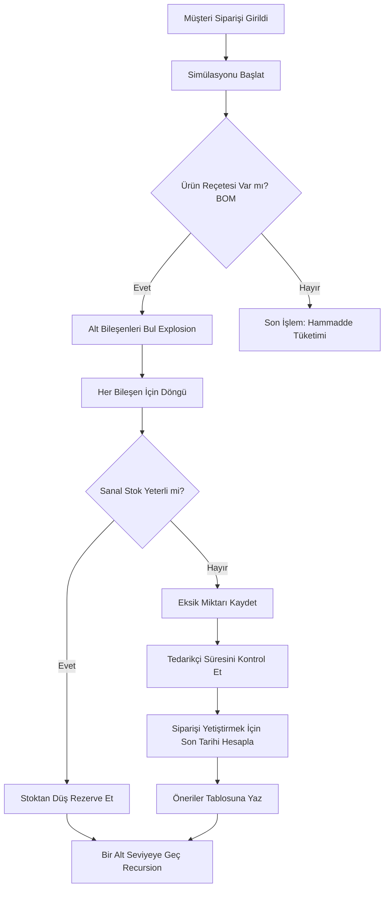

# 🗺️ Sipariş Haritalama ve Simülasyon Süreci

## 1. Genel Bakış
Sipariş Haritalama (Order Mapping), sistemin **"Geleceği Simüle Etme"** yeteneğidir. Müşteriden alınan bir siparişin, hammadde envanterine olan etkisini zaman ekseninde analiz eder.

Bu süreç, statik (durağan) bir stok kontrolü değil, **Dinamik Zamanlı Envanter (Time-Phased Inventory)** takibidir.

---

## 2. Süreç Adımları

### Adım 1: Tetikleme ve Başlatma
*   Kullanıcı **Müşteri Siparişi** girdiğinde veya `Simülasyonu Sıfırla` dediğinde süreç başlar.
*   Sistem önce **Sanal Stok Tablosunu (`sip_harita_active_inventory`)** gerçek stokla eşitler. Yani simülasyon her zaman güncel veriden başlar.

### Adım 2: BOM Patlatma (Recursive Explosion)
Sipariş edilen ürün (Örn: Masa) için BOM (Ürün Reçetesi) taranır:
*   Masa için 4 Ayak, 1 Tabla gerekir.
*   Eğer Ayak da üretiliyorsa, onun da altına inilir (Örn: Ayak için 1kg Demir).
*   Bu işlem en alt seviye hammaddeye (Level 9) kadar **Recursive (Özyineli)** olarak devam eder.

### Adım 3: Stok Rezervasyonu ve Eksik Hesabı
Her bir bileşen için şu kontrol yapılır:
`Sanal Stok` - `İhtiyaç` > 0 mı?
*   **Evet:** Sanal stoktan düşülür. (Rezervasyon).
*   **Hayır:** Stok eksiye düşer. Bu miktar **"Eksik İhtiyaç" (Shortage)** olarak işaretlenir.

### Adım 4: Zamanlama (Scheduling)
*   Siparişin teslim tarihinden geriye doğru gidilerek `Üretim Süresi` ve `Tedarik Süresi` düşülür.
*   Böylece hammaddenin **"Ne zaman sipariş edilmesi gerektiği"** bulunur.

---

## 3. Akış Diyagramı (Flowchart)

## 4. Teknik Detaylar
*   **Sanal Stok:** Simülasyon sırasında `active_inventory` tablosuna asla dokunulmaz. Tüm işlemler `sip_harita_active_inventory` üzerinde gerçekleşir. Bu sayede simülasyon gerçek hayatı etkilemez.
*   **Thread Safety:** Her sipariş simülasyonu atomik olarak işlenir.
*   **Order ID Tracking:** Bir eksik tespit edildiğinde, bunun "Hangi Müşteri Siparişi" yüzünden olduğu `sim_order_effects` tablosunda `order_id` ile saklanır. Bu sayede "Ahmet Bey'in siparişi için 5 vida eksik" diyebilirsiniz.
