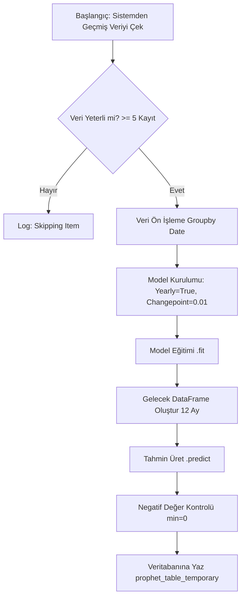

# 🔮 Prophet Algoritması: Teknik Çalışma Prensibi

## 1. Genel Bakış
Facebook (Meta) tarafından geliştirilen **Prophet**, özellikle mevsimselliğin güçlü olduğu ve veri setinde aykırı değerlerin (outliers) bulunduğu zaman serilerinde yüksek doğrulukla çalışan bir tahminleme kütüphanesidir.

Bu sistemde Prophet, **Uzun Vadeli Talep Tahmini** için kullanılır. Yani, "Önümüzdeki ay veya yıl hangi üründen ne kadar satarız?" sorusuna yanıt arar.

---

## 2. Model Parametreleri ve Konfigürasyon
Sistemimizdeki (`prophet.py`) konfigürasyon şu şekildedir:

### A. Mevsimsellik (Seasonality)
*   **Yıllık Mevsimsellik (`yearly_seasonality=True`):** Sistemin en güçlü olduğu yerdir. Örneğin, "Dondurma yazın artar, kışın azalır" gibi yıllık döngüleri öğrenir.
*   **Haftalık/Günlük Mevsimsellik (`False`):** Üretim planlaması aylık bazda yapıldığı için, haftalık dalgalanmalar gürültü (noise) yaratmaması adına kapatılmıştır.

### B. Değişim Noktaları (Changepoints)
*   **`changepoint_prior_scale=0.01`:** Bu parametre modelin **"esnekliğini"** belirler.
    *   Değer düşük (0.01) seçilerek modelin **daha muhafazakar** olması sağlanmıştır.
    *   Yani model, satıştaki her ani sıçramayı "yeni bir trend başladı" olarak yorumlamaz, bunun yerine genel eğilimi takip eder. Bu da yanlış alarm riskini azaltır.

---

## 3. Veri Hazırlama Süreci (Preprocessing)
Prophet, verinin çok spesifik bir formatta olmasını ister:

1.  **Ham Veri:** `sales_out_history` tablosundan `date` ve `amount` çekilir.
2.  **Yeniden Adlandırma:** Sütunlar `ds` (Datestamp) ve `y` (Value) olarak değiştirilir.
3.  **Aggregation (Toplama):** Prophet aynı güne ait birden fazla kayıt kabul etmez. Bu yüzden `groupby('ds')['y'].sum()` işlemi uygulanarak, günlük toplam satışlar tek satıra indirilir.
4.  **Yetersiz Veri Kontrolü:** Eğer bir ürünün geçmişinde 5'ten az veri noktası varsa, model overfit olacağı için tahmin çalıştırılmaz.

---

## 4. Tahmin Akışı (Flowchart)

## 5. Çıktının Yorumlanması
Modelin ürettiği sonuç (`yhat`), doğrudan "**Gelecek Dönem Beklenen Satış**" olarak kullanılır.

*   Model çıktısı bazen matematiksel olarak negatif olabilir (örneğin satış trendi aşağı doğruysa).
*   Sistemimizdeki **Post-Processing** katmanı, negatif tahminleri `0`'a eşitler (`max(0, yhat)`). Çünkü negatif satış fiziksel olarak imkansızdır.
